```
------------- ESPECIALIZACIÓN EN INTELIGENCIA ARTIFICIAL Y BIG DATA -------------
---------------------------------------------------------------------------------

Módulo:                     BIG DATA APLICADO
Profesor:                   Víctor J. González
Unidad de Trabajo:          UT01. Introducción al Big Data y paradigmas distribuidos
Apartado:                   2.- Apache Hadoop.
Resultados de aprendizaje:  RA2
```

# UT01: INTRODUCCIÓN A BIG DATA Y PARADIGMAS DISTRIBUIDOS


## 2. Apache Hadoop

### 2.1.- Definición

**Apache Hadoop** es un *framework* de software de código abierto que permite el almacenamiento distribuido y el procesamiento paralelo de grandes volúmenes de datos utilizando clústeres de ordenadores convencionales.

- **Framework de software:** Conjunto estructurado de librerías, servicios y herramientas diseñadas para construir aplicaciones analíticas distribuidas sin necesidad de programar la infraestructura de bajo nivel desde cero.
- **Código abierto:** Proyecto auspiciado por la *Apache Software Foundation* bajo licencia Open Source, lo que permite su uso, personalización y redistribución sin costes de adquisición de licencias.
- **Grandes volúmenes de datos:** Diseñado específicamente para procesar volúmenes masivos de datos (del orden de Terabytes o Petabytes) que desbordan la capacidad de los sistemas tradicionales.
- **Clústeres de ordenadores convencionales (*Commodity Hardware*):** Opera sobre agrupaciones de máquinas estándar conectadas en red que funcionan de forma coordinada, evitando la necesidad de recurrir a supercomputadores costosos.


### 2.2.- Componentes principales

Hadoop resuelve las necesidades de almacenamiento masivo y procesamiento eficiente mediante dos componentes fundamentales:

- **HDFS (Hadoop Distributed File System):** Sistema de archivos distribuido que divide los ficheros de gran tamaño en bloques y los almacena a lo largo de los nodos del clúster. Proporciona alta disponibilidad mediante la replicación automática de bloques y está optimizado para operaciones secuenciales de lectura y escritura.
- **YARN (Yet Another Resource Negotiator):** Gestor centralizado de recursos del clúster introducido en Hadoop 2.x. Desacopla la gestión de hardware del modelo de ejecución, permitiendo que múltiples motores de procesamiento compartan los recursos del entorno.

### 2.3.- Características de Hadoop

- **Escalabilidad:** Crecimiento horizontal ágil y transparente mediante la adición de nuevos nodos al clúster.
- **Tolerancia a fallos:** Replicación de bloques en nodos físicos independientes para prevenir la pérdida de datos ante incidentes de hardware.
- **Portabilidad:** Desarrollado íntegramente en Java, lo que posibilita su despliegue sobre diversas plataformas y sistemas operativos.
- **Eficiencia:** Procesamiento paralelo masivo que explota el principio de localidad de los datos.
- **Ecosistema en expansión:** Amplia comunidad que proporciona un ecosistema continuo de herramientas complementarias.


### 2.4.- Historia de Hadoop

- **Inicios de los 2000:** Google requiere indexar y procesar miles de millones de páginas web de forma eficiente.
- **2003:** Google publica el artículo científico *"The Google File System"* (GFS), describiendo su arquitectura de sistema de archivos distribuido.
- **2004:** Jeffrey Dean y Sanjay Ghemawat (Google) publican el artículo *"MapReduce: simplified data processing on large clusters"*, sentando las bases del procesamiento paralelo distribuido.
- **2004:** Doug Cutting y Mike Cafarella desarrollan el proyecto de motor de búsqueda de código abierto **Nutch** en Yahoo! y deciden implementar estas especificaciones para superar sus cuellos de botella de escalabilidad.
- **2005:** La tecnología de almacenamiento y cómputo de Nutch se independiza bajo el nombre de **Hadoop**, llamado así en homenaje al elefante de juguete del hijo de Doug Cutting.
- **2006:** Hadoop se convierte en un proyecto independiente de primer nivel dentro de la *Apache Software Foundation*, con Yahoo! como patrocinador principal.
- **2012:** Aparición de **Hadoop 2.0**, incorporando **YARN**. Esto desacopló la gestión de recursos de MapReduce, permitiendo la integración de otros motores de procesamiento dentro del mismo clúster.
- **Actualidad:** Hadoop engloba un ecosistema completo de herramientas de código abierto orientadas a cubrir todas las fases del ciclo de vida del dato.


### 2.5.- Herramientas del ecosistema Hadoop

El ecosistema de Hadoop dispone de decenas de herramientas que cubren prácticamente cualquier necesidad surgida al trabajar en Big Data. En la siguiente tabla se muestran algunas de las más destacables.

|    | Herramienta | Tipo / Propósito | Descripción funcional |
| -- | :--- | :--- | :--- |
|  | **Apache Hive** | *Data Warehousing* / SQL | Permite realizar consultas y análisis sobre datos en HDFS utilizando el lenguaje declarativo **HiveQL** (similar a SQL). |
| 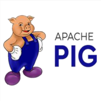 | **Apache Pig** | Procesamiento / Scripting | Plataforma de alto nivel para diseñar tareas complejas de MapReduce mediante el lenguaje de scripting procedural **Pig Latin**. |
|  | **Apache Spark** | Motor de Cómputo en Memoria | Motor de cómputo en memoria para análisis en tiempo real, procesos *batch* y *Machine Learning*, compatible con Scala, Java, Python y R. |
| 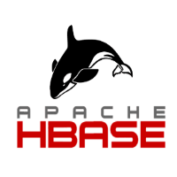 | **Apache HBase** | Base de Datos NoSQL | Base de datos NoSQL distribuida, columnar y escalable que se ejecuta sobre HDFS. |
|  | **Apache Kafka** | Ingesta / *Streaming* | Plataforma distribuida de mensajería y publicación/suscripción para la transmisión de flujos de eventos en tiempo real. |
| 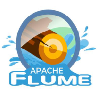 | **Apache Flume** | Ingesta de Logs | Servicio orientado a la recolección, agregación y movimiento masivo de datos de *logs* hacia HDFS. |
| 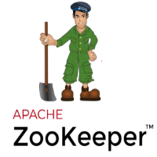 | **Apache ZooKeeper** | Coordinación de Clúster | Servicio centralizado para el mantenimiento de configuraciones, sincronización y alta disponibilidad en sistemas distribuidos. |
| 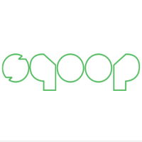 | **Apache Sqoop** | Transferencia de Datos | Herramienta de transferencia bidireccional eficiente entre Hadoop y bases de datos relacionales (MySQL, Oracle, etc.). |
|  | **Apache Oozie** | Orquestación / *Workflow* | Sistema para programar y orquestar flujos de trabajo (*workflows*) complejos entre múltiples componentes de Hadoop. |
|  | **Apache Mahout** | *Machine Learning* | Biblioteca escalable de algoritmos de aprendizaje automático para clasificación, recomendación y agrupamiento. |
| 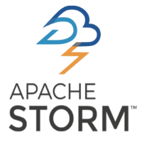 | **Apache Storm** | *Streaming* en Tiempo Real | Sistema distribuido enfocado en el procesamiento de flujos continuos de datos en tiempo real. |
| 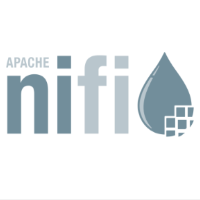 | **Apache NiFi** | Automatización de Flujos | Plataforma con interfaz gráfica para diseñar, automatizar y controlar el flujo y transformación de datos entre sistemas. |
|  | **Apache Tez** | Motor de Ejecución de Tareas | *Framework* optimizado para la ejecución de grafos de procesamiento dirigidos, con mayor rendimiento que MapReduce. |
|  | **Apache Drill** | Motor SQL Interactivo | Motor de consultas SQL distribuidas sobre datos no estructurados o semiestructurados (JSON, Parquet, CSV) sin esquema previo. |
| 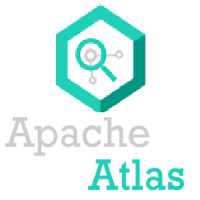 | **Apache Atlas** | Gobernanza de Datos | Marco de gobernanza, catalogación y seguimiento del linaje de metadatos en entornos Hadoop. |
| 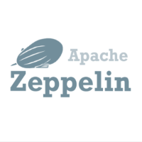 | **Apache Zeppelin** | Cuadernos Interactivos | *Notebook* interactivo colaborativo para análisis exploratorio, visualización y desarrollo con Spark, Hive, Python, etc. |
| 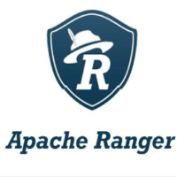 | **Apache Ranger** | Seguridad y Auditoría | *Framework* de seguridad para la administración centralizada de directivas de control de acceso y auditoría. |
|  | **Apache Ambari** | Gestión y Monitorización | Herramienta visual orientada al aprovisionamiento, gestión, configuración y supervisión operativa del clúster. |
| 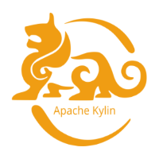 | **Apache Kylin** | Motor OLAP | Motor analítico en línea (OLAP) de baja latencia diseñado para procesar consultas multidimensionales sobre Hadoop. |
| 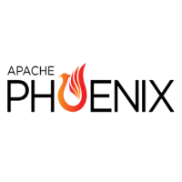 | **Apache Phoenix** | Capa SQL sobre HBase | Motor relacional SQL de baja latencia que opera de forma nativa sobre tablas HBase. |
| 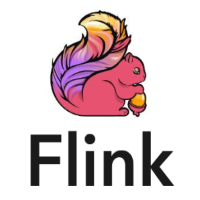 | **Apache Flink** | Procesamiento de *Streams* | Framework para el procesamiento de flujos continuos (*streaming*) en tiempo real y por lotes a gran escala. |
|  | **Apache Knox** | Pasarela de Seguridad | *Gateway* perimetral que centraliza y securiza el acceso web y API a los servicios del clúster. |
| 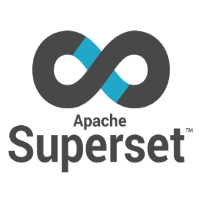 | **Apache Superset** | Visualización de Datos | Plataforma moderna de exploración y visualización de datos para la confección de cuadros de mando interactivos. |


### 2.6.- Problemas que resuelve Apache Hadoop

Apache Hadoop soluciona las limitaciones tradicionales del procesamiento de datos abordando los siguientes aspectos clave:

- **Escalabilidad Horizontal:** Permite escalar la infraestructura añadiendo nodos económicos convencionales al clúster, absorbiendo grandes volúmenes de datos sin requerir hardware vertical privativo.
- **Almacenamiento Distribuido:** HDFS divide los ficheros en bloques y los almacena en los nodos de datos (*DataNodes*) bajo la gestión del nodo maestro (*NameNode*), garantizando redundancia y alta disponibilidad.
- **Procesamiento Paralelo:** El nodo maestro (*Master*) coordina la división de tareas entre múltiples nodos de trabajo (*Workers*), ejecutando las operaciones computacionales de forma concurrente.
- **Tolerancia a Fallos:** Mediante la replicación automática de bloques y la reasignación de tareas que presenten errores, el sistema garantiza continuidad sin requerir procesos tradicionales de copia de seguridad continua.
- **Flexibilidad en el Tratamiento de Datos:** Capacidad nativa para procesar simultáneamente datos estructurados, semiestructurados (JSON, XML) y no estructurados (vídeo, imágenes, logs, texto).
- **Reducción de Costes:** Al basarse en código abierto y apoyarse sobre *commodity hardware*, democratiza el análisis masivo de datos reduciendo la inversión frente a soluciones propietarias.


---

[Volver al índice](ut01_index.md)